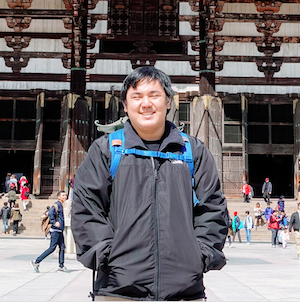

---
# You don't need to edit this file, it's empty on purpose.
# Edit theme's home layout instead if you wanna make some changes
# See: https://jekyllrb.com/docs/themes/#overriding-theme-defaults
layout: home
---

    

        
    

    

        

            <b> Pepe Berba</b>. I blog about stats, security, and crypto. 
        

        

            I'm in Threat Detection and Hunting at <a
            href="https://canva.com/">Canva</a>
        

        

            Ex-Machine Learning Researcher at Thinking Machines and previously a SOC Engineer at Redrock IT Security.
        

    

